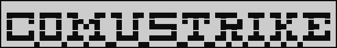

Unofficial Romustrike master server

# Contributors

- Stalker2106
- SheatNoisette

# Pre-built binary

The server is available in pre-built binaries on Release section

NOTE: The server uses MySQL "MariaDB" engine to persist data.
Install any edition from: https://mariadb.com/downloads/ prior to running the server

To configure your server, you can run it once, and it will create a `config.json` file alongside its binary.
Just edit the `config.json` file to match your DB settings, and the server should start!

# From source

Requirements:
- NodeJS 18 or later

    yarn install
    yarn start

# Launch arguments

    --debug or -d: Launch the application in debug mode

    --fillDB: Erase all the DB models and fill with default data

    --forceLocalhost: Force all host fields in responses to be localhost. Use this when running the server locally to be able to download assets from server

# Documentation

The server has a built-in Swagger endpoint on `/documentation`
Note that the endpoint is only served when the application is started in __debug__ mode

# Web interface

The server is configured to serve a web interface on `/` to check server status.
It also comes with a registration page to create new accounts on `/register`
